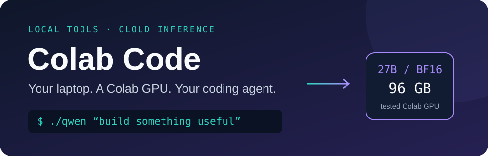

<div align="center">



# Your own coding agent. Powered by your Colab GPU.

**Self-host the model. Code in your local repo. Keep building.**

[](LICENSE)
[](https://github.com/mucahitrtn/colab-code/actions/workflows/checks.yml)
[](https://huggingface.co/Qwen/Qwen3.8-27B)

An open-source recipe for running **Qwen3.8-27B in BF16 on a Colab GPU**, with a **Cline coding agent in your local terminal**. Read files, edit code, and run tests in the project already open in VS Code.

**No project-imposed message quota. Your GPU runtime is the budget.** Keep asking it to build, fix, and iterate while your Colab session has resources available. Inference uses your Colab compute credits rather than a hosted model API's per-token allowance.

[Get started](docs/setup.md) · [See the evidence](docs/validation.md) · [Contribute](CONTRIBUTING.md) · [Roadmap](docs/roadmap.md)

</div>

## Describe it. Let the agent work in your repo.

Turn an idea into files you can open, run, and change. Ask the agent to scaffold an app, investigate a failing test, or explain unfamiliar code—then review the changes in your usual editor.

```bash
./qwen --timeout 0 'Build a Streamlit todo app with add, complete, and delete actions.'
./qwen --timeout 0 'Investigate the failing tests. Fix the cause and run the relevant tests.'
./qwen 'Explain this project and suggest a small improvement before changing anything.'
```

You choose the project and task. The agent uses local file and terminal tools; Qwen handles inference on your Colab GPU. The examples are tasks to try, not additional benchmark results.

Already have spare Colab credits? **Put them to work on the code you actually want to build.** GPU costs, runtime availability, and context limits still apply; this setup does not promise unlimited or free compute.

## Your GPU does the thinking. Your laptop does the work.

Have Colab compute credits and a laptop that cannot fit a 27B model? Connect the two. The model runs in Colab; Cline runs on your computer and uses your local files and terminal. Edits appear directly in your editor.

```text
VS Code / terminal → local Cline agent → loopback API → SSH tunnel → Colab vLLM + Qwen
                         ↓
                  your files + tests
```

- **Full BF16 weights:** tested on a 96 GB RTX PRO 6000 Blackwell GPU.
- **Real local tools:** the agent can read, edit, and execute commands in your selected project.
- **An interactive terminal:** launch `./qwen` and describe what you want to build.
- **An OpenAI-compatible endpoint:** connect compatible clients to `http://127.0.0.1:8000/v1`.
- **An authenticated SSH path:** API stays on the runtime loopback interface; no public inference URL is required.
- **Reproducible starting point:** pinned model revision, pinned Cline and vLLM versions, recorded pilot results.

## Get started

You need Python 3.10+, Node.js 22+, OpenSSH, a Google account with Colab GPU access, and enough credits. The tested configuration uses a 96 GB GPU; smaller GPUs and other platforms need separate validation. Local scripts target macOS/Linux.

```bash
git clone https://github.com/mucahitrtn/colab-code.git
cd colab-code
./qwen setup
```

Then follow the **[GPU setup guide](docs/setup.md)** to authenticate Colab, prepare the model, and open the tunnel. Setup installs local tools; it does not allocate a GPU or start billing.

Once the server and tunnel are ready:

```bash
# Chat in your current project
./qwen

# Give a task to another project
./qwen --cwd /path/to/project \
  'Build a Streamlit todo app. Support adding, completing, and deleting tasks. Run the tests.'

# Request tool approvals instead of allowing tools automatically
./qwen --auto-approve false
```

The agent automatically approves tools by default, including shell commands. Choose a project you intend it to modify; use the approval flag when you want to review tool actions. Project context sent for inference is processed in Colab. This is cloud inference with local tools.

## What we actually tested

| Check | Observed result |
| --- | --- |
| Model loading | 50.22 GiB of weights; BF16, text-only serving |
| API | Authentication, generation, streaming, reasoning separation, and a two-turn tool exchange passed |
| Local coding agent | Read and edited a Python file, ran tests; 3 failing tests became **5/5 passing** |
| Synthetic context recall | Marker recalled at **8,039 / 16,039 / 32,039** input tokens |

These are integration checks and **one small coding task**, not a coding leaderboard or a comparison against Claude Code. The context test uses repeated filler, not a realistic repository. See [methodology and raw evidence](docs/validation.md).

## Commands

| Command | Purpose |
| --- | --- |
| `./qwen setup` | Install local Colab CLI, Cline, and a dedicated SSH key |
| `./qwen tunnel` | Keep the authenticated API tunnel open |
| `./qwen sync-key` | Fetch the runtime API key without printing it |
| `./qwen smoke` | Check the live API; writes a local result report |
| `./qwen context` | Show the live server and agent context budgets |
| `./qwen context 65536` | Restart an idle server with a chosen context limit |
| `./qwen` | Open interactive terminal chat |
| `./qwen 'your task'` | Run one coding task; default timeout 180 seconds |
| `./qwen --timeout 0 'your task'` | Run a task without the wrapper timeout |

The native Cline VS Code panel can use the same endpoint; it needs separate provider settings. Our pilot tested the terminal CLI. See [editor integration](docs/setup.md#vs-code-panel-optional).

## Choose your context

```bash
./qwen context          # inspect live limits
./qwen context 65536    # 64K
./qwen context 131072   # 128K
```

Stop local agent clients before changing the limit. The command refuses to interrupt active or queued requests, restarts vLLM, and waits for the new limit. Values from 16,384 to the model's native 262,144 tokens are accepted; actual startup capacity depends on GPU memory. Cline reads the new budget on its next launch. This is a configurable restart, not live hot reloading.

## Know before you run

- Colab GPU availability, runtime duration, and compute-unit rates vary. **Closing the tunnel does not stop the GPU session.** Use `.venv/bin/colab stop -s qwen38-bf16` when finished.
- The server launcher now defaults to a 131,072-token context and one concurrent sequence. The original recorded pilot used 32,768 tokens. The CLI reads the live server limit and reserves 8,192 tokens for output. It does not enable image input.
- Cline's generic-provider `--thinking none` did not disable Qwen thinking in our pilot. Direct API requests can use `chat_template_kwargs: {"enable_thinking": false}`.
- A fresh runtime may require downloading the ~55.6 GB checkpoint again. This is a tested recipe, with further automation on the [roadmap](docs/roadmap.md).

## Help make spare GPU credits useful

Try it on a small project, share a reproducible result, or contribute another tested GPU configuration. **If this saves you setup time, star the repo so others can find it.** [Open an issue](https://github.com/mucahitrtn/colab-code/issues/new/choose) with your GPU, versions, task, and outcome—without credentials.

Built with [Google Colab CLI](https://github.com/googlecolab/google-colab-cli), [vLLM](https://github.com/vllm-project/vllm), [Qwen](https://huggingface.co/Qwen/Qwen3.8-27B), and [Cline](https://github.com/cline/cline). Independent community project; no affiliation implied. Repository code is MIT licensed; upstream tools and model weights retain their own licenses.
